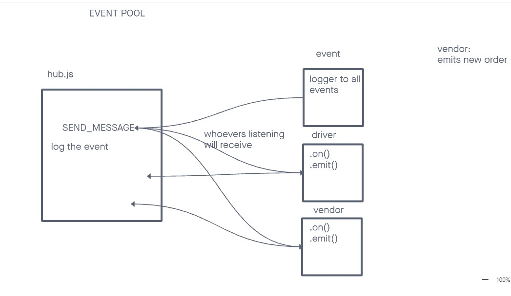
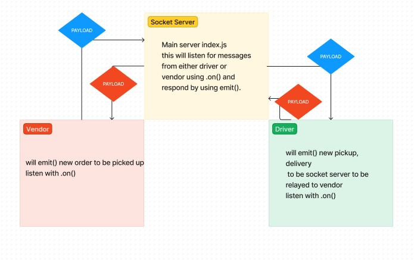

# caps

The Code Academy Parcel Service. A system that emulates a real world supply chain. CAPS will simulate a delivery service where vendors (such a flower shops) will ship products using our delivery service and when our drivers deliver them, each vendor will be notified that their customers received what they purchased.

## LAB 12

In this phase, we’ll be moving away from using Node Events for managing a pool of events, instead refactoring to using the Socket.io libraries. This allows communication between Server and Client applications. Build the data services that will drive a suit of applications where we can see pickups and deliveries in real-time.

## Collaborations

Referenced and followed along during Code Review with instructor Ryan Gallaway.

- **Lab 12** - UML for lab 12 help from Reece. Sat at a table with Reece, Ike, and had assistance from Stephen, Kaleen, and Ryan.

## UML

