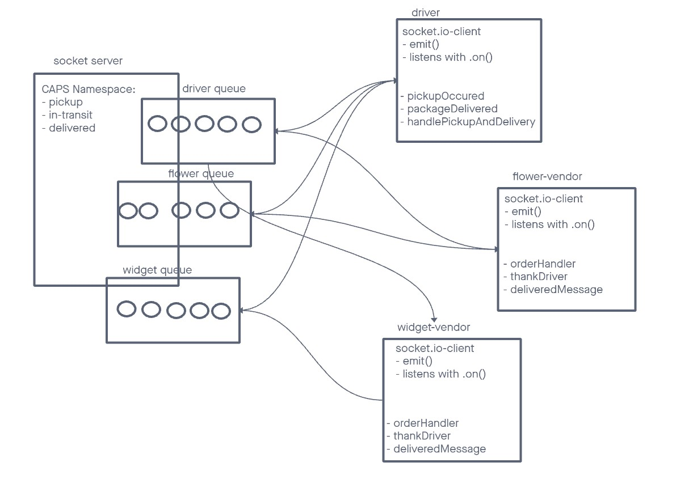

# Project: CAPS

## Author: Kaeden O'Meara

## Problem Domain

The Code Academy Parcel Service. A system that emulates a real world supply chain. CAPS will simulate a delivery service where vendors (such a flower shops) will ship products using our delivery service and when our drivers deliver them, each vendor will be notified that their customers received what they purchased.

## LAB 12

In this phase, we’ll be moving away from using Node Events for managing a pool of events, instead refactoring to using the Socket.io libraries. This allows communication between Server and Client applications. Build the data services that will drive a suit of applications where we can see pickups and deliveries in real-time.

## LAB 13

Rather than just triggering an event notification and hope that client applications respond, we’re going to implement a “Queue” system so that nothing gets lost. Every event sent will be logged and held onto by the server until the intended recipient acknowledges that they received the message. At any time, a subscriber can get all of the messages they might have missed.

## Collaborations

Referenced and followed along during Code Review with instructor Ryan Gallaway.

- **Lab 12** - UML for lab 12 help from Reece. Sat at a table with Reece, Ike, and had assistance from Stephen, Kaleen, and Ryan.

- **Lab 13** - Referenced Code Review and had some help from instructor Ryan Gallaway.

## UML

## Setup

### How to initialize/run your application

Clone repo, `npm i`, alter `.env` file, `npm start`.

## Tests

To run tests, after running `npm i`, run the command `npm test`
